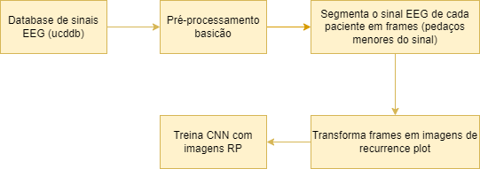

# Meu TCC!!
Quero me formar em julho, deixa pfvr.

## Sobre o projeto
Detectar apneia do sono em sinais EEG com redes neurais convolucionas e recurrence plot

Quer ler meu TCC? ainda não terminei 🤣

## Ferramentas utilizadas

- Python 3
- Conda
- Tensorflow 
- Pandas
- Numpy
- Seaborn

# Base de dados

[St. Vincent's University Hospital / University College Dublin Sleep Apnea Database](https://physionet.org/content/ucddb/1.0.0/)

## Diagrama sobre o fluxo das coisas

## Quer rodar meu modelo?

1. Faça o download da base de dados mencionada acima
2. Escolha um diretorio para gerar o dataset (o dataset é gerado numa estrutura já pronta pra ser consumida pelo tensorflow).
3. Edite e execute o script `dataset_generator.py`, basicamente você precisa alterar o path do database e o path do storage (onde as imagens serão criadas)
4. Altere o path do storage no notebook do model `tcc_model.ipynb` e vai rodando lá as celulas, deve estar ok (eu acho)

## Acha que consegue fazer melhor?

Não é muito dificil, abre uma PR aí! Fique a vontade!

Made with python, coffee and hate.